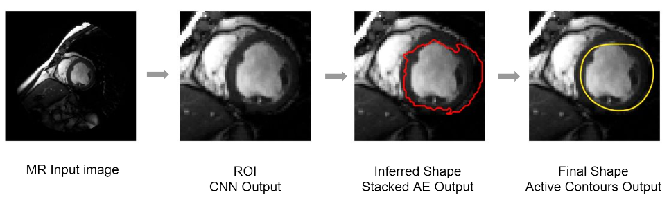
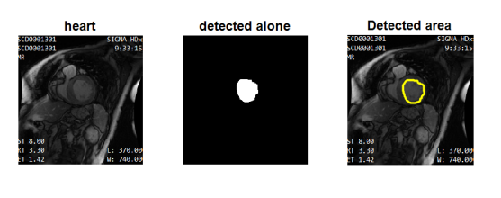
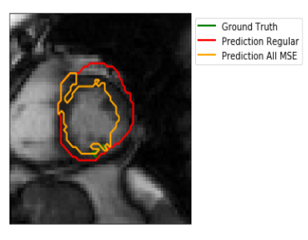
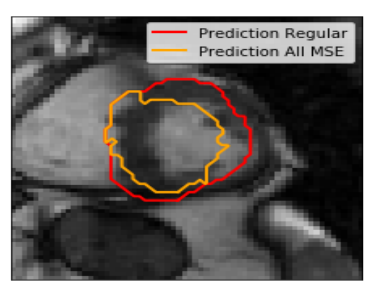

# CARDIAC MRI IMAGE ANALYSIS -  Identifying Left Ventricle using Deep learning
The research base for analysis of medical images for automatic detection of various diseases has immensely increased over the last decade.There are a number of researchers working in this field. The primary challenges faced by them are the amount of image data and the time required for analysis. Also, in case of images obtained by the MRI machine,sometimes there is a noise induced due to the internal noise of the machine. The objective of our project is to reduce the noise induced in the input images by using noise reduction techniques, and to implement segmentation techniques.We have used Atlas Based segmentation technique for segmenting the image.We have also implemented deep learning techniques in order to automate the segmentation process.

## Objective
Automatically identify the Left ventricle in cardiac MRI

## Dataset
MICCAI 2009 Challenge database.
Left Ventricle MR Images+manually delineated contours
Trainset :495 (MRi/Contours)

## Approach
Convolutional Neural Network + Auto Encoders 

Entire util functions and code for neural network is present in LVIAutomationUsingNN.ipynb. The same with python version is present in lviautomationusingnn.py

## Output Samples

## References
- [1] https://github.com/alexattia/Medical-Image-Analysis
- [2] M. R. Avendi, A. Kheradvar and H. Jafarkhani. A Combined Deep-Learning and Deformable-Model Approach to Fully Automatic Segmentation of the Left Ventricle in Cardiac MRI. 2015
- [3] A. Attia and S. Dayan. Detection and segmentation of the Left Ventricle in Cardiac MRI using Deep Learning. 2017.

## Developer Info
- Manjunath C Bagewadi
- Email : manjunathsept11@gmail.com
- Ph: 9742896702
- Linked In : linkedin.com/in/manjunath-bagewadi-9325ab55

